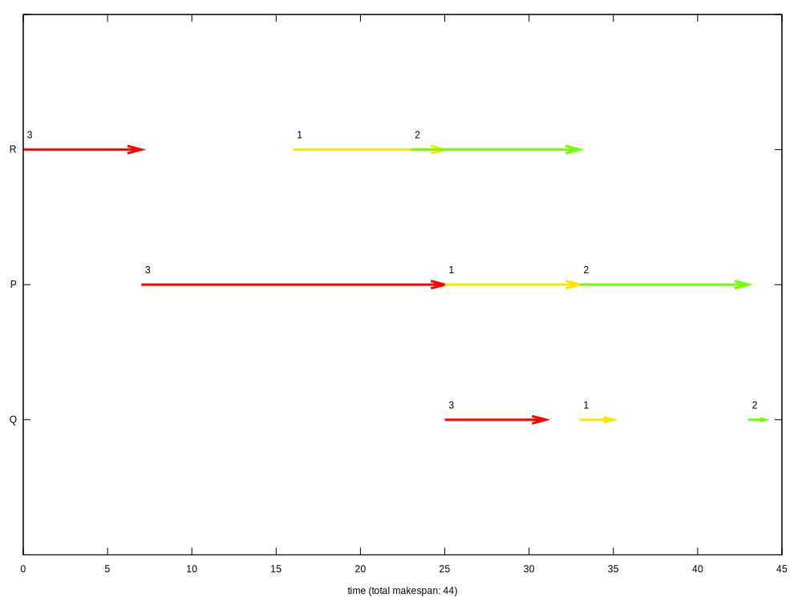
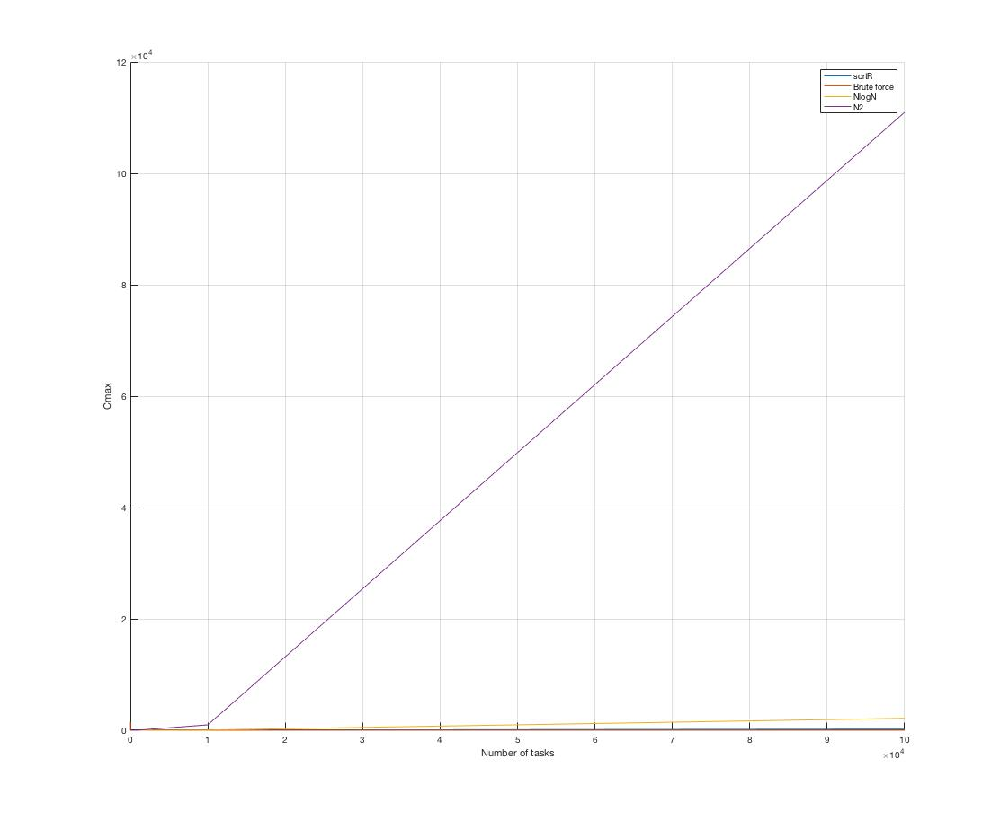
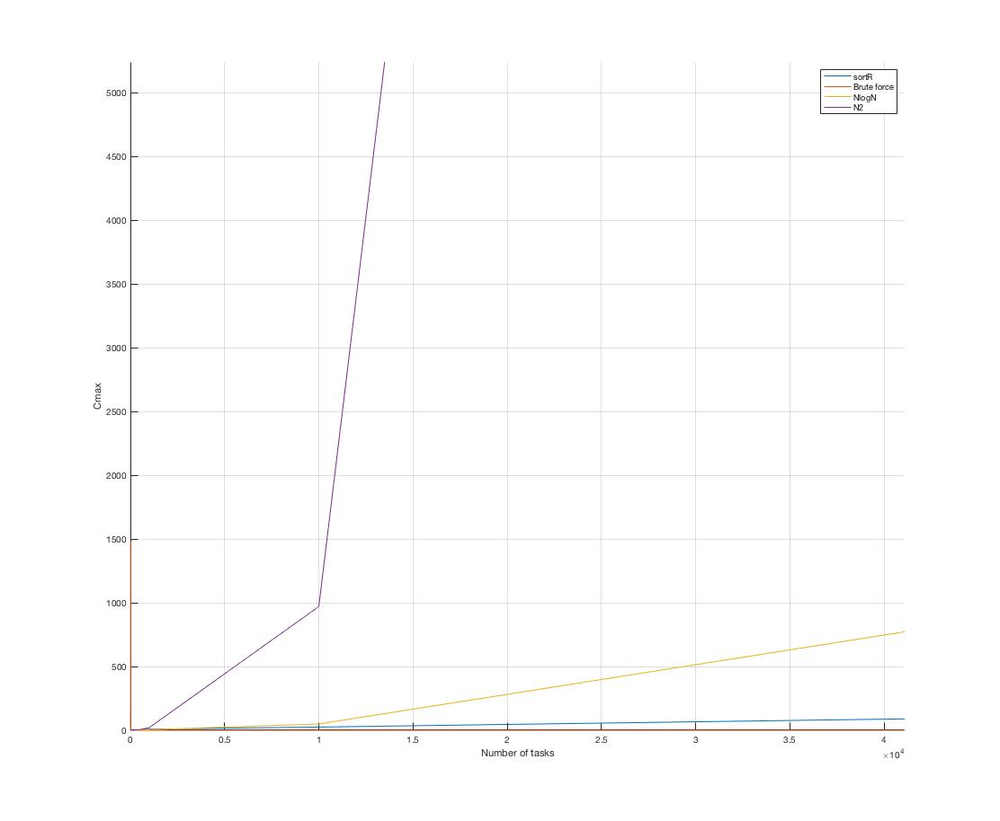

# README
Brute force, sortR and schrage (O(n log n) and O(n^2)) algorithm for solving single machine RPQ problem

Tasks are created in loop. Values of R, P and Q are generated randomly for every task.
Computation time for both algorithms available for comparison.

You may want to change:
1. Number of tasks by changing `TASK_COUNT`
2. Minimal time for step by changing `MIN_TIME`
3. Maximal time for step by changing `MAX_TIME`
4. You can save some time by turning off `SHOW_PERMUTATIONS`
5. To `GENERATE_PLOT` You will need `gnuplot`
6. I used `GENERATE_TEST_DATA` to generate tables below (with some Matlab help)
7. Turn off brute force for large datasets

### Test times

Average computing time of 10 attempts. Tasks sets are the same for given number of tasks between attempts.

| Number of tasks: |sortR  | make span | Brute force | make span| Schrage (NlogN) | make span | Schrage (N^2) | make span |
| ------------- |-------------:| -----:| -----:| -----:| -----:| -----:| -----:| -----:|
|2|0.0154 ms|49|0.0100 ms|49|0.0426 ms|49|0.0217 ms|49|
|3|0.0163 ms|77|0.0214 ms|75|0.0316 ms|77|0.0216 ms|77|
|4|0.0216 ms|96|0.0273 ms|96|0.0385 ms|96|0.0186 ms|96|
|5|0.0227 ms|138|0.0602 ms|129|0.0393 ms|129|0.0271 ms|129|
|6|0.0187 ms|108|0.2665 ms|104|0.0409 ms|104|0.0242 ms|104|
|7|0.0188 ms|103|1.8711 ms|89|0.0348 ms|90|0.0224 ms|90|
|8|0.0585 ms|128|16.6137 ms|105|0.0949 ms|105|0.0522 ms|105|
|9|0.0290 ms|122|156.7284 ms|103|0.0493 ms|103|0.0290 ms|103|
|10|0.0385 ms|131|1480.6160 ms|124|0.0605 ms|125|0.0444 ms|125|
|11|0.0264 ms|187|Too long|0|0.0971 ms|170|0.0381 ms|170|
|12|0.0212 ms|170|Too long|0|0.0606 ms|156|0.0379 ms|156|
|13|0.0248 ms|208|Too long|0|0.0630 ms|193|0.0468 ms|193|
|14|0.0200 ms|205|Too long|0|0.0718 ms|205|0.0718 ms|205|
|15|0.0281 ms|228|Too long|0|0.0668 ms|222|0.0474 ms|222|
|20|0.0394 ms|318|Too long|0|0.0879 ms|311|0.3772 ms|311|
|50|0.0596 ms|673|Too long|0|0.1208 ms|657|0.1457 ms|657|
|100|1.6682 ms|1616|Too long|0|0.2638 ms|1589|1.1415 ms|1589|
|500|3.9100 ms|7482|Too long|0|2.2240 ms|7475|4.9365 ms|7475|
|1000|9.2107 ms|14888|Too long|0|4.9307 ms|14887|20.6674 ms|14887|
|10000|25.2531 ms|150931|Too long|0|49.4152 ms|150921|970.3883 ms|150921|
|100000|210.9550 ms|1496789|Too long|0|2141.9050 ms|1496768|110983.9000 ms|1496768|

### Visualisation
I'm using `gnuplot` to visualise chosen task order.

Example visualisation for three machines (number above arrow represents task ID):

### Summary
SortR is fastest algorithm but not ideal, Schrage (N^2) gives better results but slower for large amount of data.
Schrage (NlogN) gives same results as (N^2) approach but significantly faster for large amount of data.

Below You can see plot for whole range and closeup.

 
*for SPD lab pt11 on PWR*